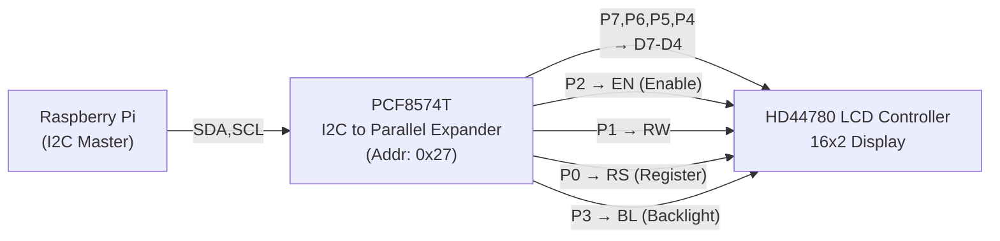

# i2c-lcd-drivers
LCD 1602 drivers

```mermaid
flowchart LR
    RPi["Raspberry Pi\n(I2C Master)"] -- SDA,SCL --> PCF["PCF8574T\nI2C to Parallel Expander\n(Addr: 0x27)"]
    PCF -- "P7,P6,P5,P4\n→ D7-D4" --> LCD["HD44780 LCD Controller\n16x2 Display"]
    PCF -- "P2 → EN (Enable)" --> LCD
    PCF -- "P1 → RW" --> LCD
    PCF -- "P0 → RS (Register)" --> LCD
    PCF -- "P3 → BL (Backlight)" --> LCD
```
